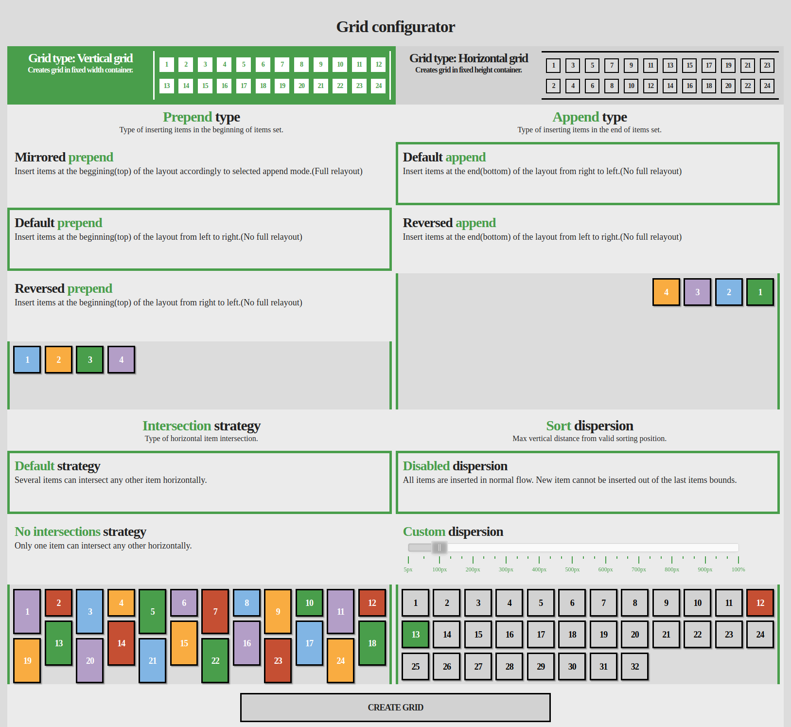
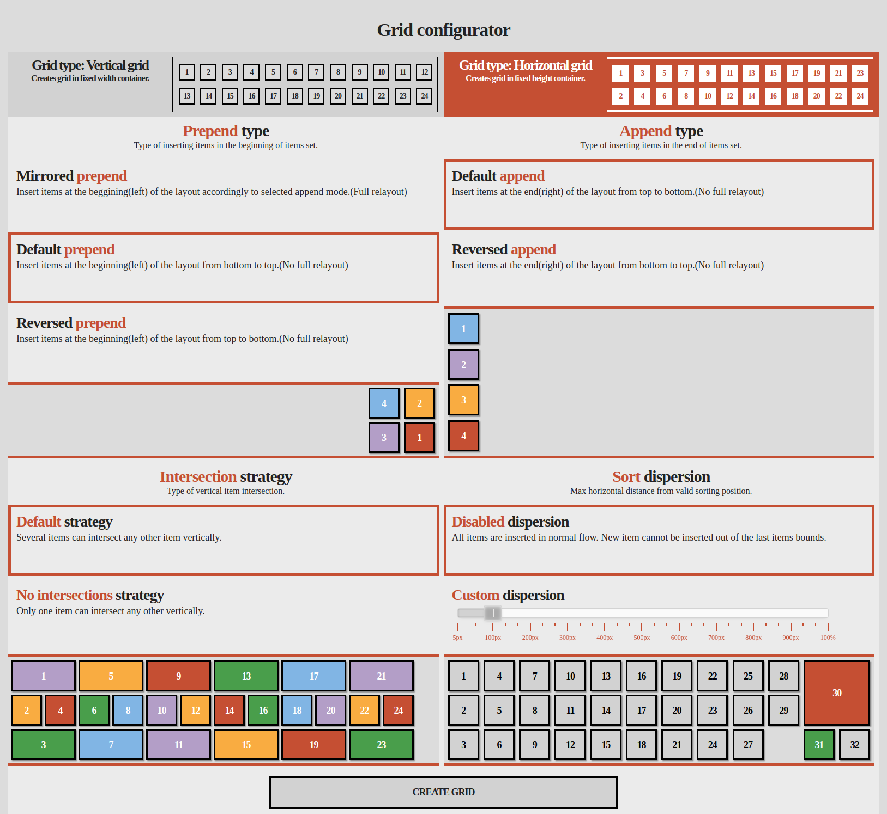
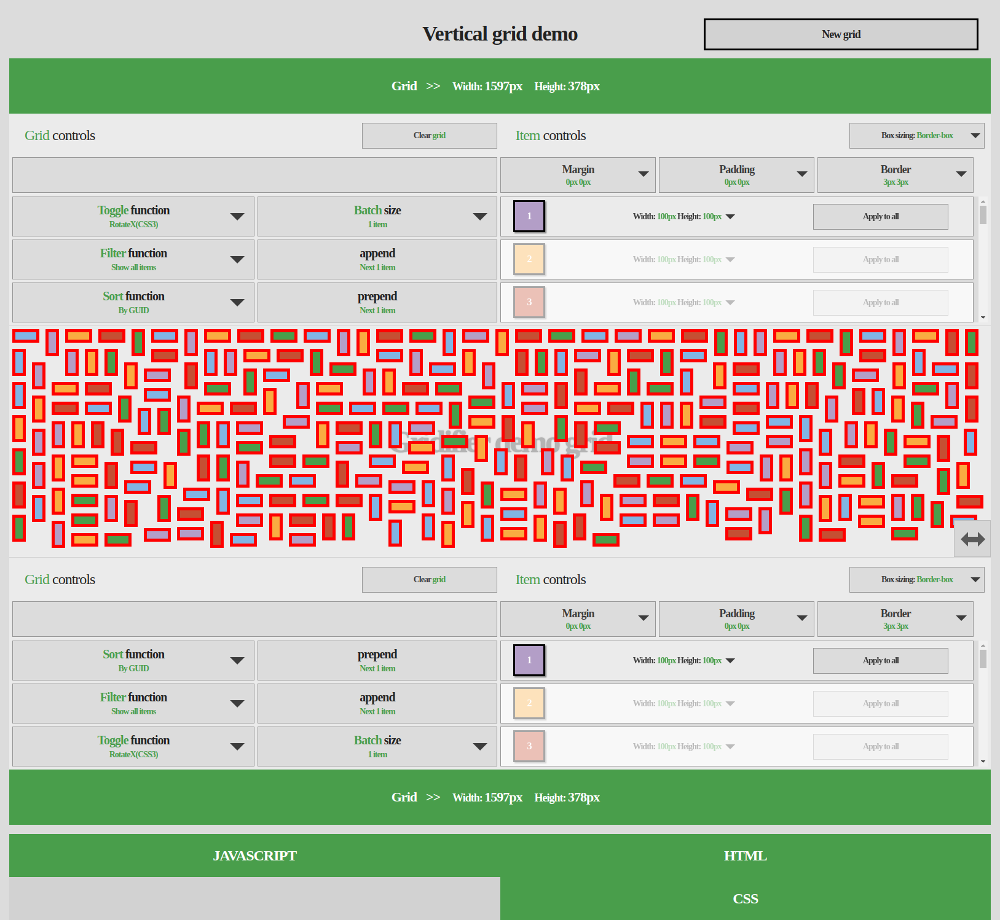
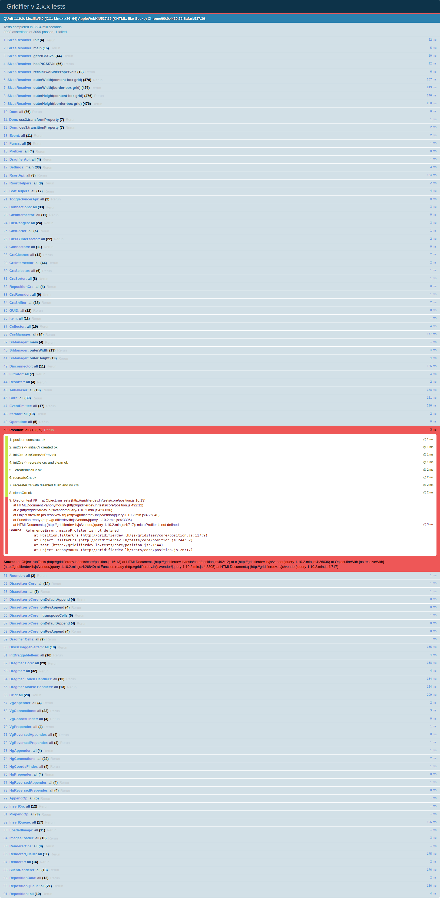
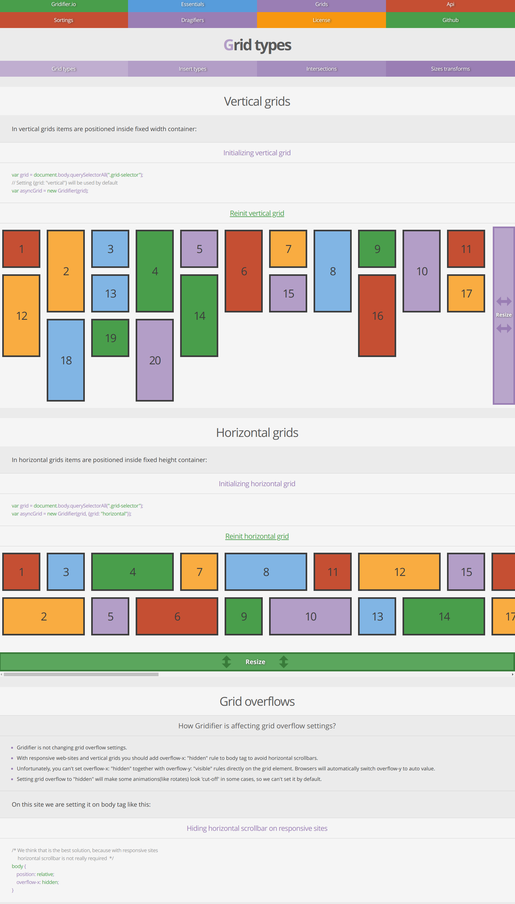

<div id="top"></div>

<!-- INTRO -->
<br />
<div align="center">
  <h3 align="center">Library for grid layout sort/filter + multitouch drag and drop</h3>

  <p align="center">
    One of my prev projects which I have successfully developed and used in many commercial projects.  This repo contains code for library builder website - a special type of webapp in which all library features can be tested manually with all possible options + library tests suite can be executed. After successful testing new version of library can be build(using Grunt) and uploaded into separate public library repo for clients.
    Repo for clients: <a href="https://github.com/nix23/gridifier">Open repo for clients</a>.
  </p>
</div>

<!-- LIBRARY BUILDER WEBSITE SHORT OVERVIEW -->
## Library Builder Website Short Overview

### /js/demoLayoutBuilder

* /js/init.js (entry point script for index.html) structure:
  ```sh
    $(document).ready(function() {
        // ...
        // Html-files are loaded dynamically in this project with twig.js library.
        // Twig is used here because I did not want to add backend for this project
        // just to load templates through ajax.
        View.init();
        
        // Main application class -> listens for all main page events and processes them
        var demoLayoutBuilder = new DemoLayoutBuilder($("#demoLayoutContainer"));
    });
  ```

* /js/demoLayoutBuilder/demoLayoutBuilder.js structure:
  ```sh
    DemoLayoutBuilder = function($targetEl) {
        var me = this;

        // Setting root page view
        this._$view = View.attach(this._$view, $targetEl, View.ids.DEMO_LAYOUT_BUILDER.DEMO_LAYOUT_BUILDER);
        // ... Other vars declaration

        this._construct = function() {
            // Finding all child views required in this class
            me._$demoLayoutBuilder = me._$view.parent().find("." + me._css.demoLayoutBuilderClass);
            // ...

            // I prefer to split all page UI cmps into objects and then include them using composition.
            me._gridConfigurator = new DemoLayoutBuilder.Configurator(me._$gridConfiguratorAccordionTab, me);
            
            this._bindEvents(); 
            // ...
        }

        this._bindEvents = function() {
            me._bindGridConfiguratorEvents();
            // ...
        }

        // In most cases communication with composed objects is done using events
        this._bindGridConfiguratorEvents = function() {
            $(me._gridConfigurator).on(DemoLayoutBuilder.Configurator.EVENT_CREATE_VERTICAL_GRID, function(event, gridifierSettings) {            
                me._gridLayout = new DemoLayoutBuilder.DemoLayout(
                    // ...
                );
                // ...
            });

            $(me._gridConfigurator).on(DemoLayoutBuilder.Configurator.EVENT_CREATE_HORIZONTAL_GRID, function(event, gridifierSettings) {            
                me._gridLayout = new DemoLayoutBuilder.DemoLayout(
                    // ...
                );
                // ...
            });
        }

        // ...

        // Clear on page change
        this.destruct = function() {
            me._unbindEvents();
        }

        this._construct();
        return this;
    }

    DemoLayoutBuilder.EVENT_CREATE_GRID = "demoLayoutBuilder.createGrid";
    // ... Declaring other events

    // Declaring all required fns in prototype
    DemoLayoutBuilder.prototype._showGridLayoutAccordionTab = function() {
        // ...
    }
    // ...
  ```

* /js/demoLayoutBuilder/configurator/ structure:
  ```sh
    // Contains classes for 'Create new grid' page.
    // Main page class DemoLayoutBuilder.Configurator(/js/demoLayoutBuilder/configurator/configurator.js)
    // is created in main app class DemoLayoutBuilder(/js/demoLayoutBuilder/demoLayoutBuilder.js).
  ```

* /js/demoLayoutBuilder/demoLayout/ structure:
  ```sh
    // Contains classes for main page.
    // Main page class DemoLayoutBuilder.DemoLayout(/js/demoLayoutBuilder/demoLayout/demoLayout.js) 
    // is created in main app class DemoLayoutBuilder(/js/demoLayoutBuilder/demoLayoutBuilder).
    // By default DemoLayout is created with vertical grid. DemoLayout can be recreated later with 
    // vertical or horizontal grid.
  ```

### /js/gridifier/

* /js/gridifier/loader/ structure:
  ```sh
    // Wraps lib in module on build to create local scope
    (function (root, factory) {
        if (typeof define === 'function' && define.amd) {
            define([], factory);
        } else if (typeof exports === 'object' && exports) {
            module.exports = factory();
        } else {
            root.Gridifier = factory();
        }
    }(this, function () {
        var Gridifier = function(sourceGrid, sourceSettings) {
  ```

* /js/gridifier/gridifier.js (entry point script for library) structure:
  ```sh
    // Contains core dom jquery-alike fns: find by id/class/query, css ops/css3 animations, etc...
    Dom.init();
    // Contains core jquery-alike fns to calc item offset/position, outer width/height, uncomputed/computed css + fixes for < ie8
    SizesResolver.init();

    // ... Create all main library classes
    var core = new Core();
  ```

* /js/gridifier/core/core.js structure:
  ```sh
    var Core = function() {
        // Contains all fns which can be used by library clients
        self(this, {
            destroy: // ...,
            toggle: // ...,
            sort: // ...,
            // All public API fns, as well as internal events works with 3 main library queues.
            // (operations queue, reposition queue, render queue)
            // Queues were created to minimize performance loses, caused by browsers reflow process when you
            // insert/sort/filter/drag many items simultaneously. 
            filter: function(fn) {
                reposition.sync();
                gridifier.setApi("filter", fn);
                filtrator.filter();
                reposition.all();

                return gridifier;
            },
            reposition: // ...,
            prepend: // ...,
            append: // ...,
            silentAppend: // ...,
            insertBefore: // ...,
            insertAfter: // ...,
        });
    };
  ```

* /js/gridifier/core/position.js structure:
  ```sh
    // Library stores all item positions using skyline bin-packing algo.
    // Shortly, each html element has entry in connections array where x/y
    // coordinate of its position is stored. Algo declares special rules how to
    // recalculate x/y positions for each html element without creating gaps between
    // elements.
    proto(Position, {
      findCnCoords: function(/* ... */) {
      },
      createCn: function(item, cnCoords, sortedCrs) {
        var cn = connections.add(item, cnCoords);
        // ...
      },
      // ...
    });
  ```

* /js/gridifier/api/toggle/ structure:
  ```sh
    // Library provides different core animation effects(can be extended):
    // scale, fade, rotate, different types of slides, visibility.
    RotateToggleFactory = function(settings) {
        // ...
    }

    proto(RotateToggleFactory, {
        create: function() {
            var postfixes = ["", "WithFade", "WithFadeOut"];
            // ...

            for(var i = 0; i < postfixes.length; i++) {
                for(var prop in ROTATE.MATRICES) {
                    var matrix = ROTATE.MATRICES[prop];
                    this._create("rotate3d" + prop + postfixes[i], "show3d", "hide3d", matrix, fades[i]);
                }
                // ...
            }
        },
    // ...
  ```

* /js/gridifier/dragifier/ structure:
  ```sh
    // Library supports 2 types of drag and drop modes: intersection or discretization.
    // Intersection -> drag is triggered when dragged item is intersecting any other item center.
    // Discretization -> draggable area is split into cells of equal size. Drag is triggered when dragged item is
    // intersecting any cell center. 
    Dragifier = function() {
        this._items = [];
        this._isDragging = false;

        // ...
    }

    proto(Dragifier, {
        _touchStart: // ...
        _touchEnd: function(event) {
            var me = this;
            if(!me._isDragging) return;

            var touches = event.changedTouches;
            for(var i = 0; i < touches.length; i++) {
                var itemData = me._findDraggableById(touches[i].identifier, true);
                if(itemData.item == null) continue;
                itemData.item.rmDragId(touches[i].identifier);

                if(itemData.item.getDragIdsCount() == 0) {
                    itemData.item.unbind();
                    me._items.splice(itemData.itemIndex, 1);
                }
            }

            if(me._items.length == 0) me._endDrag();
        },
        _touchMove: // ...
        // ...
    });
  ```

* /js/gridifier/inserter/, /js/gridifier/reposition/, /js/gridifier/renderer/ (queues) structure:
  ```sh
    var InsertQueue = function() {
        // Array({'op' => 'op', 'items/item' => 'i', 'opSpecificParam1' => 'osp1', ...}, ...., n )
        this._queue = [];
    }
    proto(InsertQueue, {
        itemsToBatches: function(items, batchSize, disNative) {
            // ...
            return itemBatches;
        },
        // ...

        _execSchedule: function(items, targetItem, op, opFn) {
            var me = this;
            if(repositionQueue.isEmpty())
                opFn(items, targetItem, op);
            else {
                me._queue.push({
                    op: op,
                    items: items,
                    targetItem: targetItem
                });
                // ...
                me._process.call();
            }
        },

        _process: function() {
            var me = this;
            var wereAllQueueOpsExec = true;
            for(var i = 0; i < this._queue.length; i++) {
                if(!repositionQueue.isEmpty()) {
                    setTimeout(function() { me._process.call(me); }, C.INSERT_QUEUE_DELAY);
                    wereAllQueueOpsExec = false;
                    break;
                }

                var qe = this._queue[i];
                this._exec(qe.items, qe.targetItem, qe.op);
                this._queue.shift();
                i--;
            }
        },
    });

    var RepositionQueue = function() {
        this._queue = null;
        // ...
    }

    proto(RepositionQueue, {
        _isSameRepositionProcess: function() {
            // ...
            return isSameProcess;
        },

        _repositionNextBatch: function(checkSameProcess) { 
            // ...
            this._execNextBatchReposition(batchSize);
            this._processQueue(batchSize);
        },

        _execNextBatchReposition: function(batchSize) {
            for(var i = 0; i < batchSize; i++) {
                this._repositionItem(this._queue[i].item);
                // ...
            }

            // ...
            renderer.renderRepositioned(repositionedCns);
        },

        _processQueue: function(batchSize) {
            // ...
            this._scheduleNextBatchReposition();
        },

        _scheduleNextBatchReposition: function() {
            var me = this;
            this._nextBatchTimeout = setTimeout(function() {
                me._repositionNextBatch.call(me, true);
            }, settings.get("queueDelay"));
        },

        _repositionItem: function(item) {
            // ...
        }
    });

    var RendererQueue = function() {
        // Array[
        //     [0] => {cn: cn, op: op, left: left, top: top}, ..., n
        // ]
        this._queue = null;
        // ....
    }

    proto(RendererQueue, {
        schedule: function(op, cn, left, top, delay) {
            // ...
            this._queue.push({
                op: op, cn: cn, left: left, top: top, delay: delay
            });
            this._queueTimeout = setTimeout(function() {
                me._process.call(me);
            }, C.RENDER_QUEUE_DELAY);
        },

        _process: function() {
            for(var i = 0; i < this._queue.length; i++) {
                var r = this._queue[i];
                // ...
                // fn = show || hide
                this["_" + fn](r.cn, r.left, r.top, this._getApi(), r.op, r.delay);
            }

            grid.scheduleResize();
            this._queue = null;
        },

        _show: function(cn, left, top, api) {
            var getS = bind("get", settings);

            api.dom.css.set(cn.item, {
                position: "absolute", left: left, top: top
            });

            settings.getApi("coordsChanger")(/* ... args */);
            settings.getApi("toggle").show(/* ... args */);
        },

        _hide: function(cn, left, top, api) {
            // ...
        },

        _render: function(cn, left, top, api, op, delay) {
            if(op == RENDER_OPS.RENDER)
                this._execRender(cn.item, left, top, api);
            else {
                setTimeout(function() {
                    // ...
                    me._execRender(newCn.item, rendererCns.left(newCn), rendererCns.top(newCn), api);
                }, delay);
            }
        },

        _execRender: function(item, left, top, api) {
            // ...
            settings.getApi("coordsChanger")(
                item, left, top, time, timing, api.dom, api.prefix, getS
            );
        }
    });
  ```

<!-- TESTS SUITE SHORT OVERVIEW -->
## Tests Suite Short Overview

### /tests

* /tests.html (entry point script for tests) structure:
  ```sh
    // Connects all scripts + Qunit. Then connect all scripts with tests.
  ```

* /tests/core/core.js (one of test scripts) structure:
  ```sh
    $(document).ready(function() {
        module("Core");

        var tester = {
            _before: function() {},
            _after: function() {},

            runTests: function() {
                var me = this;

                // Run tests suite
                test("all", function(assert) {
                    var test = function(tests) {
                        me._before.call(me);

                        for(var i = 0; i < tests.length; i++)
                            me["_" + tests[i]].call(me, assert);

                        me._after.call(me);
                    }

                    var origBind = Core.prototype._bindEvents;
                    Core.prototype._bindEvents = fns.nop();
                    test([
                        "repositionFns",
                        "rotate",
                        // ...
                    ]);
                    Core.prototype._bindEvents = origBind;
                    me._eventsWithDelay.call(me, assert);
                });
            },

            _repositionFns: function() {
                // Mocking data
                var core = new Core();
                var getData = function() {
                    return {
                        setApiName: null, 
                        reposed: false,
                        // ...
                    };
                };

                reposition = {};
                reposition.all = function() { data.reposed = true; };
                
                // ...

                var origGridifier = gridifier;

                gridifier = {};
                core = new Core();
                data = getData();
                res = gridifier.reposition();
                ok(res == gridifier && data.asUpdated && data.reposed, "reposition ok");

                gridifier = origGridifier;
                clearTestData();
            },

            _eventsWithDelay: function(assert) {
                var origEvent = null;
                var cc = 0;
                var reposed = false;
                var core = null;

                var initFn = function() {
                    ev = new EventEmitter();
                    sourceSettings = {vpResizeDelay: 0};
                    settings = new Settings();

                    origEvent = Event;
                    Event = {};
                    Event.add = function(obj, evName, handler) {};

                    core = new Core();
                    gridifier = {};
                    gridifier.reposition = function() { reposed = true; cc++; };
                    gridifier.isDragifierOn = fns.f();

                    core._onResize();
                    core._onResize();
                };
                var checkFn = function() {
                    ok(reposed && cc == 1, "resize with delay ok");
                    Event = origEvent;
                    core._unbindEvents();
                };

                asyncTests.add(assert, initFn, checkFn, 20, this);
            }

            // ...
        }

        tester.runTests();
        clearTestData();
    });
  ```

<!-- WEBSITE OVERVIEW -->
## Website Overview

<div align="center">
  <h3 align="center">Grid configurator: horizontal grid</h3>
</div>

<a href="img/screen/1.png?raw=true">
  <p align="center">
    
  </p>
</a>

<div align="center">
  <h3 align="center">Grid configurator: vertical grid</h3>
</div>

<a href="img/screen/2.png?raw=true">
  <p align="center">
    
  </p>
</a>

<div align="center">
  <h3 align="center">Library builder main page</h3>
</div>

<a href="img/screen/3.png?raw=true">
  <p align="center">
    
  </p>
</a>

<div align="center">
  <h3 align="center">Tests suite page</h3>
</div>

<a href="img/screen/4.png?raw=true">
  <p align="center">
    
  </p>
</a>

<div align="center">
    <h3 align="center">Website with documentation</h3>
</div>

<p align="center">
    <a href="http://45.55.240.120/app.php/">Open website with docs</a>
</p>

<a href="img/screen/5.png?raw=true">
  <p align="center">
    
  </p>
</a>

<p align="right">(<a href="#top">back to top</a>)</p>